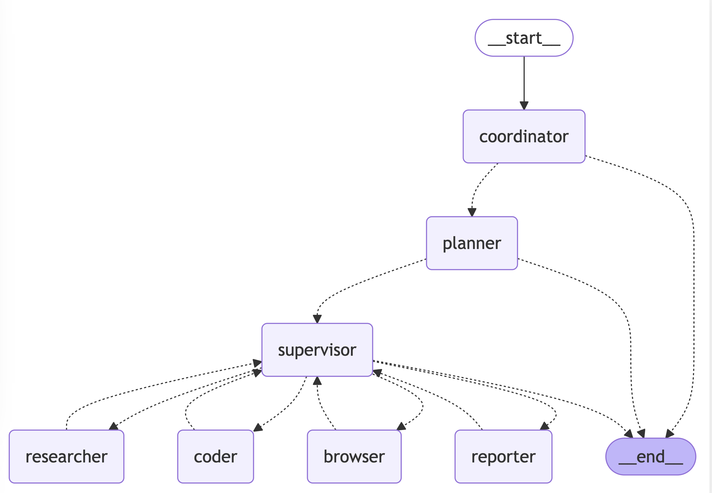

# 🦜🤖 DeepManus

[](https://www.python.org/downloads/)
[](https://opensource.org/licenses/MIT)
[](./assets/wechat_community.jpg)
[](https://discord.gg/m3MszDcn)

[English](./README.md) | [简体中文](./README_zh.md) | [日本語](./README_ja.md)

> Come From Open Source, Back to Open Source

DeepManus is an AI automation framework developed based on LangManus, using deepseek as the large model, with fewer third-party frameworks, making it easier to use in China. The project is built on the excellent work of the open source community. The goal of the project is to give language models hands and feet.

## Demo

**Task**: Calculate the influence index of DeepSeek R1 on HuggingFace. This index can be designed by considering a weighted sum of factors such as followers, downloads, and likes.

**DeepManus's Fully Automated Plan and Solution**:

1. **Gather the latest information**  
   Obtain the latest information about "DeepSeek R1", "HuggingFace", and related topics through online searches.

2. **Visit the HuggingFace official website**  
   Use a Chromium instance to visit the HuggingFace official website, search for "DeepSeek R1", and retrieve the latest data, including followers, likes, downloads, and other relevant metrics.

3. **Find model influence calculation formulas**  
   Use search engines and web scraping techniques to look for relevant formulas or methods for calculating model influence.

4. **Use Python to calculate the influence index**  
   Based on the collected data, use Python programming to calculate the influence index of DeepSeek R1.

5. **Generate a comprehensive report**  
   Organize the analysis results into a comprehensive report and present it to the user.

## Table of Contents

- [Quick Start](#quick-start)
- [Project Statement](#project-statement)
- [Architecture](#architecture)
- [Features](#features)
- [Why DeepManus?](#why-DeepManus)
- [Setup](#setup)
    - [Prerequisites](#prerequisites)
    - [Installation](#installation)
    - [Configuration](#configuration)
- [Usage](#usage)
- [Docker](#docker)
- [Web UI](#web-ui)
- [Development](#development)
- [FAQ](#faq)
- [Contributing](#contributing)
- [License](#license)
- [Acknowledgments](#acknowledgments)

## Quick Start

```bash
# Clone the repository
git clone https://github.com/TimeCyber/DeepManus.git
cd DeepManus

# Install dependencies
uv sync

# Playwright install to use Chromium for browser-use by default
uv run playwright install

# Configure environment
cp .env.example .env
# Edit .env with your API keys

# Run the project
uv run main.py
```

## Project Statement

This project is an open-source project based on LangManus, modified to reference the Deepseek model and remove Jina. It aims to explore and exchange ideas in the fields of Multi-Agent and DeepResearch.

- **Purpose**: The main purpose of this project is large model application research, giving large models hands and feet.
- **Property Statement**: The intellectual property rights belong to Chengdu Time Cyber Technology Co., Ltd.
- **No Association**: This project has no association with Manus (whether it refers to a company, organization, or any other entity).
- **Contribution Management**: Issues and PRs will be addressed during our free time and may experience delays. We appreciate your understanding.
- **Disclaimer**: This project is open-sourced under the MIT License. Users assume all risks associated with its use. We disclaim any responsibility for any direct or indirect consequences arising from the use of this project.

## Architecture

DeepManus implements a hierarchical multi-agent system where a supervisor coordinates specialized agents to accomplish complex tasks:



The system consists of the following agents working together:

1. **Coordinator** - The entry point that handles initial interactions and routes tasks
2. **Planner** - Analyzes tasks and creates execution strategies
3. **Supervisor** - Oversees and manages the execution of other agents
4. **Researcher** - Gathers and analyzes information
5. **Coder** - Handles code generation and modifications
6. **Browser** - Performs web browsing and information retrieval
7. **Reporter** - Generates reports and summaries of the workflow results

## Features

### Core Capabilities

- 🤖 **LLM Integration**
    - Support for most models through [litellm](https://docs.litellm.ai/docs/providers)
    - Support for open source models like Qwen
    - Deepseek-compatible API interface
    - Multi-tier LLM system for different task complexities

### Tools and Integrations

- 🔍 **Search and Retrieval**
    - Web search via Tavily API
    - Using standard script
    - Advanced content extraction

### Development Features

- 🐍 **Python Integration**
    - Built-in Python REPL
    - Code execution environment
    - Package management with uv

### Workflow Management

- 📊 **Visualization and Control**
    - Workflow graph visualization
    - Multi-agent orchestration
    - Task delegation and monitoring

## Why DeepManus?

We believe in the power of open source collaboration. This project wouldn't be possible without the amazing work of projects like:

- [Qwen](https://github.com/QwenLM/Qwen) for their open source LLMs
- [Tavily](https://tavily.com/) for search capabilities
- [Browser-use](https://pypi.org/project/browser-use/) for browser control
- And many other open source contributors

We're committed to giving back to the community and welcome contributions of all kinds - whether it's code, documentation, bug reports, or feature suggestions.

## Setup

> You can also refer to [this video](https://www.youtube.com/watch?v=XzCmPOfd0D0&lc=UgyNFuKmya8R6rVm_l94AaABAg&ab_channel=01Coder) published by 01Coder

### Prerequisites

- [uv](https://github.com/astral-sh/uv) package manager

### Installation

DeepManus leverages [uv](https://github.com/astral-sh/uv) as its package manager to streamline dependency management.
Follow the steps below to set up a virtual environment and install the necessary dependencies:

```bash
# Step 1: Create and activate a virtual environment through uv
uv python install 3.12
uv venv --python 3.12

# On Unix/macOS systems:
source .venv/bin/activate

# On Windows systems:
.venv\Scripts\activate

# Step 2: Install project dependencies
uv sync
```

### Configuration

DeepManus uses a three-layer LLM system for reasoning, basic tasks, and vision-language tasks, configured using the conf.yaml file in the project root directory. You can copy `conf.yaml.example` to `conf.yaml` to start configuration:
```bash
cp conf.yaml.example conf.yaml
```

```yaml
# Setting it to true will read the conf.yaml configuration, and setting it to false will use the original .env configuration. The default is false (compatible with existing configurations)
USE_CONF: true

# LLM Config
## Follow the litellm configuration parameters: https://docs.litellm.ai/docs/providers. You can click on the specific provider document to view the completion parameter examples
REASONING_MODEL:
  model: "volcengine/ep-xxxx"
  api_key: $REASONING_API_KEY # Supports referencing the environment variable ENV_KEY in the.env file through $ENV_KEY
  api_base: $REASONING_BASE_URL

BASIC_MODEL:
  model: "azure/gpt-4o-2024-08-06"
  api_base: $AZURE_API_BASE
  api_version: $AZURE_API_VERSION
  api_key: $AZURE_API_KEY

VISION_MODEL:
  model: "azure/gpt-4o-2024-08-06"
  api_base: $AZURE_API_BASE
  api_version: $AZURE_API_VERSION
  api_key: $AZURE_API_KEY
```

You can create a .env file in the root directory of the project and configure the following environment variables. You can copy the .env.example file as a template to start:
```bash
cp .env.example .env
```
```ini
# Tool API Keys
TAVILY_API_KEY=your_tavily_api_key
JINA_API_KEY=your_jina_api_key  # Optional

# Browser Configuration
CHROME_INSTANCE_PATH=/Applications/Google Chrome.app/Contents/MacOS/Google Chrome  # Optional, path to Chrome executable
CHROME_HEADLESS=False  # Optional, default is False
CHROME_PROXY_SERVER=http://127.0.0.1:10809  # Optional, default is None
CHROME_PROXY_USERNAME=  # Optional, default is None
CHROME_PROXY_PASSWORD=  # Optional, default is None
```

> **Note:**
>
> - The system uses different models for different types of tasks:
>     - The reasoning LLM is used for complex decision-making and analysis
>     - The basic LLM is used for simple text tasks
>     - The vision-language LLM is used for tasks involving image understanding
> - The configuration of all LLMs can be customized independently
> - Tavily search is configured by default to return up to 5 results (you can obtain this key at [app.tavily.com](https://app.tavily.com/))

### Configure Pre-commit Hook

DeepManus includes a pre-commit hook that runs linting and formatting checks before each commit. To set it up:

1. Make the pre-commit script executable:

```bash
chmod +x pre-commit
```

2. Install the pre-commit hook:

```bash
ln -s ../../pre-commit .git/hooks/pre-commit
```

The pre-commit hook will automatically:

- Run linting checks (`make lint`)
- Run code formatting (`make format`)
- Add any reformatted files back to the staging area
- Prevent the commit if there are any linting or formatting errors

## Usage

### Basic Execution

Run DeepManus with default settings:

```bash
uv run main.py
```

### API Server

DeepManus provides a FastAPI-based API server with streaming response support:

```bash
# Start the API server
make serve

# Or run directly
uv run server.py
```

The API server provides the following endpoints:

- `POST /api/chat/stream`: Chat endpoint for LangGraph calls with streaming responses
    - Request body:
  ```json
  {
    "messages": [{ "role": "user", "content": "Enter your query here" }],
    "debug": false
  }
  ```
    - Returns a Server-Sent Events (SSE) stream containing agent responses

### Advanced Configuration

DeepManus can be customized through various configuration files in the `src/config` directory:

- `env.py`: Configure LLM models, API keys, and base URLs
- `tools.py`: Adjust tool-specific settings (like Tavily search result limits)
- `agents.py`: Modify team composition and agent system prompts

### Agent Prompt System

DeepManus uses a sophisticated prompt system in the `src/prompts` directory to define agent behaviors and responsibilities:

#### Core Agent Roles

- **Supervisor ([`src/prompts/supervisor.md`](src/prompts/supervisor.md))**: Coordinates the team and assigns tasks by analyzing requests and determining which expert to handle them. Responsible for deciding task completion and workflow transitions.

- **Researcher ([`src/prompts/researcher.md`](src/prompts/researcher.md))**: Specializes in gathering information through web searches and data collection. Uses Tavily search and web scraping capabilities, avoiding mathematical calculations or file operations.

- **Coder ([`src/prompts/coder.md`](src/prompts/coder.md))**: Professional software engineer role focused on Python and bash scripting. Handles:
    - Python code execution and analysis
    - Shell command execution
    - Technical problem-solving and implementation

- **File Manager ([`src/prompts/file_manager.md`](src/prompts/file_manager.md))**: Handles all file system operations with an emphasis on properly formatting and saving markdown content.

- **Browser ([`src/prompts/browser.md`](src/prompts/browser.md))**: Web interaction specialist handling:
    - Website navigation
    - Page interactions (clicking, typing, scrolling)
    - Content extraction from web pages

#### Prompt System Architecture

The prompt system uses a template engine ([`src/prompts/template.py`](src/prompts/template.py)) to:

- Load markdown templates for specific roles
- Process variable substitutions (like current time, team member information)
- Format system prompts for each agent

Each agent's prompt is defined in a separate markdown file, allowing behaviors and responsibilities to be easily modified without changing the underlying code.

## Docker

DeepManus can run in a Docker container. By default, the API server runs on port 8000.

```bash
docker build -t DeepManus .
docker run --name DeepManus -d --env-file .env -e CHROME_HEADLESS=True -p 8000:8000 DeepManus
```

You can also run the CLI directly with Docker:

```bash
docker build -t DeepManus .
docker run --rm -it --env-file .env -e CHROME_HEADLESS=True DeepManus uv run python main.py
```

## Web UI

DeepManus provides a default web interface.

Please refer to the [DeepManus/DeepManus-web](https://github.com/DeepManus/DeepManus-web) project for more information.

## Docker Compose (Including Frontend and Backend)

DeepManus provides a docker-compose setup to easily run both the backend and frontend together:

```bash
# Start backend and frontend
docker-compose up -d

# Backend will be available at http://localhost:8000
# Frontend will be available at http://localhost:3000, accessible through your browser
```

This will:
1. Build and start the DeepManus backend container
2. Build and start the DeepManus Web UI container
3. Connect them with a shared network

Make sure you have the `.env` file prepared with necessary API keys before starting the services.

## Development

### Testing

Run the test suite:

```bash
# Run all tests
make test

# Run a specific test file
pytest tests/integration/test_workflow.py

# Run coverage tests
make coverage
```

### Code Quality

```bash
# Run linting checks
make lint

# Format code
make format
```

## FAQ

Please refer to [FAQ.md](docs/FAQ_zh.md) for more information.

## Contributing

We welcome contributions of all kinds! Whether it's fixing typos, improving documentation, or adding new features, your help is appreciated. Please check out our [contribution guidelines](CONTRIBUTING.md) to get started.

## License

This project is open source and available under the [MIT License](LICENSE).

## Acknowledgments

Special thanks to all the open source projects and contributors that made DeepManus possible. We stand on the shoulders of giants.

We would particularly like to thank:
- [LangChain](https://github.com/langchain-ai/langchain): For providing an excellent framework that underpins our LLM interactions and chaining operations
- [LangGraph](https://github.com/langchain-ai/langgraph): For supporting our complex multi-agent orchestration
- [Browser-use](https://pypi.org/project/browser-use/): For providing browser control capabilities
- [LangManus](https://github.com/LangManus/LangManus): This project is based on LangManus

These excellent projects form the foundation of DeepManus and demonstrate the power of open source collaboration.
